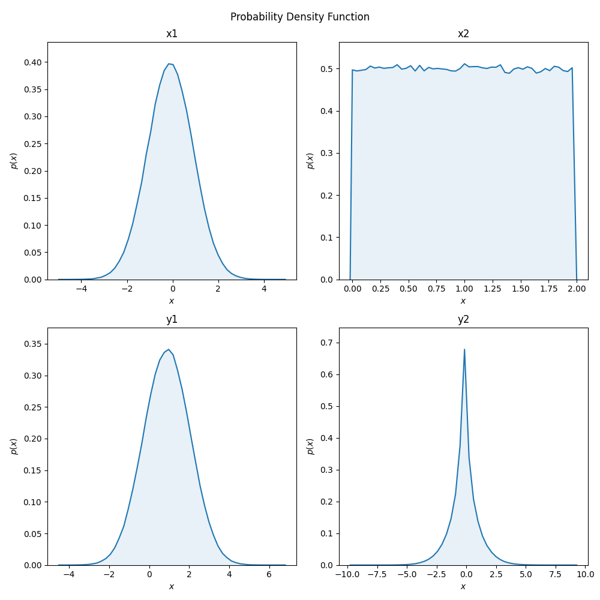

# PDFtimate

Evaluate how your code reacts to randomly distributed inputs.
Define inputs as random variables and perform Monte Carlo simulations to estimate probability density distributions (PDF) of your outputs. Designed for simple syntax.

## Installation
```
git clone https://github.com/jonasnebl/PDFtimate.git
cd PDFtimate
pip install -e .
``` 

## Quick guide

You have a function `y1, x2 = f(x1, x2)` performing some kind of calculation. `f` can have arbitrary number of argument and return values.
In our simple example `f` returns the sum and the product of two arguments `x1` and `x2`.
```
def f(x1, x2):
    return x1 + x2, x1 * x2

# call the function
x1 = 1
x2 = 2
y1, x2 = f(x1, x2)
print(y)
```
Now you want to evaluate how random inputs `x1` and `x2` influence the results `y1`and `y2` using PDFtimate.
For this you need to do two things:
1. Add the `@randify` decorator to `f`.
2. Define `x1`and/or `x2`as a RandomVariable. For selecting a probality distribution, you can pass e.g. functions from numpy's random module.
```
from PDFtimate import randify, RandomVariable
import numpy as np

@randify
def f(x1, x2):
    return x1 + x2, x1 * x2

x1 = RandomVariable(np.random.normal, loc=0, scale=1)
x2 = RandomVariable(np.random.uniform, low=-1, high=1)
y1, y2 = f(x)
```
`y1`and `y2` are now also random variables. To display the probability distributions, you can use PDFtimate's plotPDF function:
```
from PDFtimate import plotPDF
plotPDF(x1, x2, y1, y2)
```
